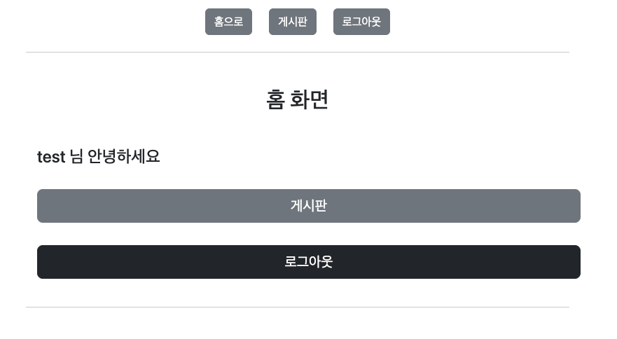

# springboot-board

Spring, JPA, Querydsl 와 배포 전략에 대해서 학습했던 내용을 실제로 사용해보기 위해 게시판이라는 주제로 구현해본 프로젝트입니다.

## 배포 구조

## ER Diagram

## 기능

- [x] 로컬 회원 가입
- [x] 로컬 회원 로그인
- [x] 스프링 시큐리티 적용
- [x] 게시글 작성
- [x] 댓글 작성 기능
- [x] 댓글 삭제 기능
- [x] 이미지 첨부 및 파일 첨부
- [x] 게시글 페이징
- [x] 댓글 페이징
- [x] 게시글 검색
- [x] oauth 회원 로그인
- [x] 게시글 수정, 삭제
- [x] 댓글 수정
- [x] 클라우드에 띄우기
- [x] jenkins로 수정 시 자동 배포
- [x] 이중화 구성

## 사용 기술

- SpringBoot 2.6.7
- Spring Data JPA
- Spring Security
- OAuth Client 2.0
- Querydsl
- Thymeleaf

## 동작 사진

